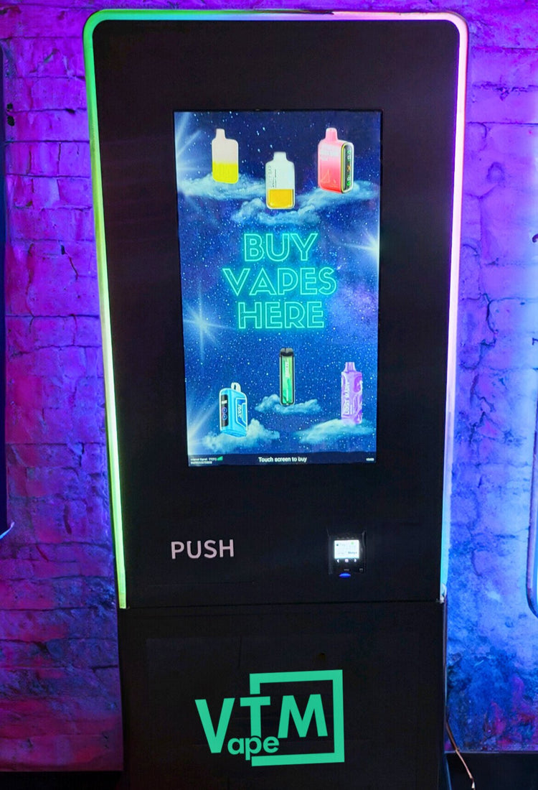
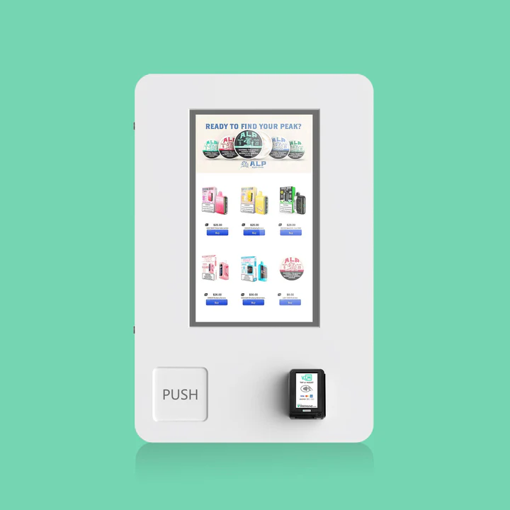

# I.S.K NightLife Vending Machine

Veteran-owned nightlife vending experience for bars, clubs, and casinos in San Antonio. This repo is a static single-page site with no build step.

## Highlights
- Static SPA with a single `index.html` entry point.
- Sections: hero, why it works, product mix, operations loop, gallery, and contact CTA.
- Ready-to-use photo assets included in the repo.

## Quick start
- Serve locally (recommended): `python -m http.server` then open the shown URL.
- Or open `index.html` directly in a browser.

## Project structure
- `index.html` — Landing page and all UI copy.
- `V1.jpeg` — Machine hero shot.
- `V2.jpeg` — Packaging/merchandising photo.
- `V3.jpeg` — Additional product detail shot.
- `V4.webp` — Lifestyle/venue image.
- `V5.webp` — Device colorways photo.

## Customization
- Update the contact email/phone in the CTA to your real details.
- Contact form: replace the `action` URL in `index.html` if you want Formsubmit, Formspree, or Netlify Forms.
- Analytics: update the Plausible `data-domain` value in `index.html` to your live domain.
- Adjust copy in `index.html` to match your offer or compliance language.
- Swap images by replacing files or updating the `gallery` section in the HTML.

## Gallery

## Compliance note
- Positioned for adult (21+) venues. Ensure age verification, applicable federal/state/local rules, and product restrictions are met before deploying.
